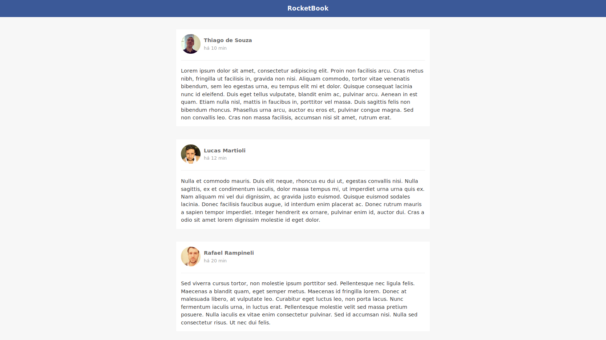

## ReactBook - GoReact Challenge #1

This project was created along the first module of ReactJS (GoStack - Rocketseat).

> # Desafio 1
>
> Configure uma estrutura ReactJS do zero com Babel, Webpack e Webpack Dev Server. Além disso, utilize as ferramentas ESLint, EditorConfig e Prettier durante o desenvolvimento desse projeto.
>
> ## Regras
>
> - O Header deve ser um componente separado;
> - O Post deve ser um componente separado;
> - O header do post aonde estão o avatar, nome e tempo do post devem estar em um componente separado chamado PostHeader;
> - Os posts devem estar armazenado no estado (state) do arquivo principal App.js;
> - Você deve passar a informação dos posts como uma única propriedade para o componente de Post quando realizar o map no state de posts: <Post data={post} />;
>
> <small>By: [Rocketseat](https://rocketseat.com.br/) </small>

 

The result you can see here! (:

 

Best regards,

**Thiago Rodrigues de Souza** \
**e-mail:** email@thiagodesouza.com.br \
**site:** [https://www.thiagodesouza.com.br](https://www.thiagodesouza.com.br)
